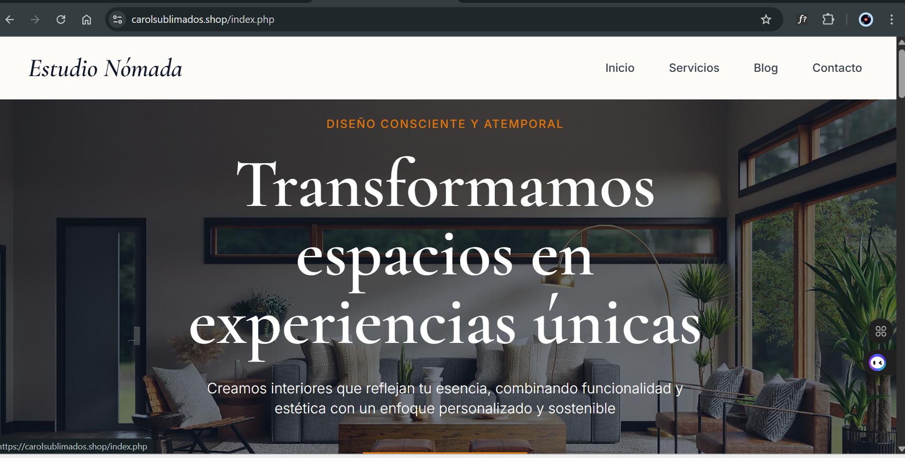

# Estudio Nómada - Frontend Premium con WordPress Headless



> **Plantilla de diseño de interiores maquetada con apoyo de IA**  
> Frontend moderno y elegante conectado a WordPress REST API

## 🌐 Demo en Vivo

**[Ver Sitio en Vivo →](https://carolsublimados.shop/)**

---

## 🤖 Sobre este Proyecto

Proyecto desarrollado por un programador profesional **utilizando herramientas de IA como asistente**, demostrando cómo la combinación de habilidades de desarrollo y asistencia de IA puede acelerar la creación de interfaces web profesionales, funcionales y estéticamente sofisticadas.

## ✨ Características Principales

- 🚀 **Arquitectura Headless CMS** - Frontend desacoplado de WordPress
- 🎨 **Diseño Premium** - Tipografía Cormorant Garamond + Tailwind CSS
- 🔌 **REST API Integration** - Consumo dinámico de contenido
- 📱 **Responsive Design** - Adaptado para todos los dispositivos
- 🔍 **SEO Optimizado** - Meta tags dinámicos y Open Graph
- 🎯 **URLs Limpias** - `/blog/proyecto` sin extensiones .php

---

## 📁 Estructura

### 1. **Arquitectura Headless CMS**
Frontend completamente desacoplado de WordPress, consumiendo datos mediante REST API.

```
Frontend (PHP) ←→ WordPress REST API ←→ WordPress CMS
```

**Ventajas:**
- Mayor velocidad de carga
- Flexibilidad total en diseño
- Seguridad mejorada
- Escalabilidad

### 2. **Sistema de Blog Dinámico**

#### [blog.php](blog.php)
- Conexión automática con WordPress REST API
- Listado de posts con paginación (9 posts por página)
- Extracción de:
  - Imagen destacada
  - Categoría principal
  - Título y extracto
  - Fecha de publicación
  - Slug para URL limpia
- Manejo elegante de errores (API no disponible)
- Mensaje personalizado si no hay posts

#### [articulo.php](articulo.php)
- Vista individual de cada proyecto/post
- Hero section con título grande
- Imagen destacada en tamaño completo
- Contenido con estilos de prosa elegantes
- Metadatos (categoría y fecha)
- CTA de navegación
- Páginas 404 personalizadas

### 3. **URLs Limpias y Amigables**

Mediante [.htaccess](.htaccess):
```
/blog              → Lista de proyectos
/blog/nombre-slug  → Artículo individual
/servicios         → Servicios (sin .php)
/contacto          → Contacto (sin .php)
```

### 4. **SEO y Meta Tags Dinámicos**

[header.php](header.php) incluye:
- Títulos dinámicos por página
- Meta descriptions personalizadas
- Open Graph tags para redes sociales
- Schema markup básico
- URLs canónicas

### 5. **Diseño Visual Premium**

**Paleta de Colores:**
- Cream: `#FDFBF7`
- Slate: `#0f172a`
- Amber: `#d97706`
- Sage: `#78866b`

**Tipografías:**
- **Cormorant Garamond**: Títulos y headings (serif elegante)
- **Inter**: Cuerpo de texto (sans-serif moderna)

**Efectos:**
- Imágenes en escala de grises que colorean al hover
- Transiciones suaves (0.3s ease)
- Hover effects en cards y enlaces
- Responsive images con lazy loading

---

## 📁 Estructura

```
wordpress/
├── index.php          # Página principal
├── servicios.php      # Servicios
├── blog.php           # Blog dinámico con WordPress API
├── articulo.php       # Vista individual de posts
├── contacto.php       # Formulario de contacto
├── header.php         # Header compartido
├── footer.php         # Footer compartido
└── .htaccess          # URLs limpias
```

---

## 🔌 Integración WordPress REST API

### Endpoints Utilizados
```
GET /wp-json/wp/v2/posts?_embed&per_page=9
GET /wp-json/wp/v2/posts?slug={slug}&_embed
```

### Datos Extraídos
- Título, contenido y extracto
- Imagen destacada
- Categoría principal
- Fecha de publicación
- Slug para URLs

---

## 🚀 Instalación Rápida

1. **Clonar** el repositorio
2. **Configurar** la URL de tu API de WordPress en:
   - `blog.php` (línea 40)
   - `articulo.php` (línea 31)
3. **Activar** `mod_rewrite` en Apache
4. **Subir** posts en WordPress con imagen destacada
5. **Listo!** Accede a tu sitio

### Requisitos
- PHP 7.4+
- Apache con `mod_rewrite`
- WordPress con REST API activa

---

## 🎨 Diseño

**Paleta de Colores:**
- Cream `#FDFBF7` - Slate `#0f172a` - Amber `#d97706`

**Tipografías:**
- **Cormorant Garamond** - Títulos elegantes
- **Inter** - Cuerpo de texto moderno

**Efectos:**
- Imágenes en escala de grises con hover a color
- Transiciones suaves (0.3s ease)

---

## 📊 Stack Tecnológico

- **Backend**: WordPress REST API
- **Frontend**: PHP puro
- **CSS**: Tailwind CSS (CDN)
- **Fonts**: Google Fonts
- **Icons**: Font Awesome 6

---

## 🔧 Funcionalidades

✅ Blog dinámico que se actualiza desde WordPress  
✅ URLs limpias sin extensiones .php  
✅ Manejo elegante de errores  
✅ Meta tags dinámicos para SEO  
✅ Páginas 404 personalizadas  
✅ Lazy loading de imágenes  

---

## 🤝 Desarrollo Profesional con Asistencia de IA

Proyecto maquetado y programado por un desarrollador profesional con apoyo de herramientas de IA, logrando:

- Código PHP funcional y limpio
- Diseño de interfaces premium
- Integración eficiente con REST APIs
- Implementación de mejores prácticas de SEO

**Ventaja**: Desarrollo acelerado sin comprometer calidad

---

## 📞 Contacto

- **Email**: hola@estudionomada.com
- **Website**: [estudionomada.com](https://estudionomada.com)

---

**Desarrollado por victor sanchez con asistencia de IA 💻🤖 | 2026**
